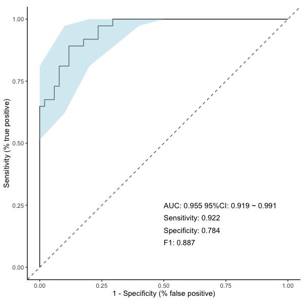
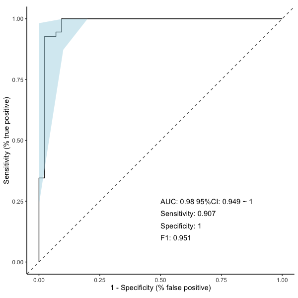

# MicroBiotR: A Comprehensive R Toolkit for SOM-Based Microbiota Flow Cytometry and Downstream Machine Learning

## Overview

MicroBiotR is a comprehensive R pipeline developed for analysis between microbiota And host phenotype such as HC vs disease. The package delivers a robust framework for examining microbiota flowcytometry, aiming to pinpoint difference of bacterial community composition potentially linked to environmental factors and host phenotypes.

## Key Features

MicrobiotR provide an All-in-One framework that supports a wide array of microbiota flow cytometry clustering and analysis, including:
* **MBR_som**: SOM calculation and to obtain count-table.
* **MBR_stat**: performe statistical analyses to identify differentially abundant features between groups.
* **MBR_circle**: visualize distributions of features within imported data by presenting them in a circular form.
* **MBR_violin**: visualize abundance or expression levels for selected features.
* **MBR_beta**: visualize and assess beta diversity between groups (PCOA plot).
* **MBR_fs**: identifying and selecting a subset of the most predictive features.
* **MBR_heatmap**: visualize patterns of channels used in flowcytometry using a color-coded matrix.
* **MBR_mantel**: quantify and visualize the relationship between features in data and clinical or demographic metadata.
* **MBR_ml**: apply machine learning algorithms and visualize using ROC curve.
* **MBR_conf**: visualize confusion matrix.
* **MBR_reclustering**: recluster the clustering results obtained from an initial Self-Organizing Map (SOM) analysis.
* **MBR_read**: load fcs file.
* **MBR_process**: prepare data for downstream analytical steps.
* **MBR_prepare**: prepare data for downstream analytical steps.
* **MBR_plot**: visualize dot plot of selected features.
* **MBR_save**: save new fcs files with user-customized clusters.

Type the function name to see its documentation (eg. ?MBR_stat)

***The FCS data used in this tutorial was generated by a BD Influx flow cytometer***

## Installation

You can firstly install these dependencies prior to installing `MicroBiotR`

```markdown
# install.packages("devtools")
devtools::install_github("Hy4m/linkET", force = TRUE)
packageVersion("linkET")

if (!require("BiocManager", quietly = TRUE))
    install.packages("BiocManager")
BiocManager::install("Biobase")

install.packages("viridis")

devtools::install_github("Bioconductor/Biobase", force = TRUE)
install.packages("BiocManager", repos = "https://cran.R-project.org")
BiocManager::install("flowCore")

```


You can install the released version of `MicroBiotR` from [GitHub](https://github.com/9cGU/MicroBiotR) with the following R commands:

```markdown
# install.packages("devtools")
devtools::install_github("9cGU/MicroBiotR", force = TRUE)
packageVersion("MicroBiotR")
```

## SOM analysis
```markdown
# load libraries
library(MicroBiotR)
library(linkET)
library(Biobase)
library(flowCore)
library(tidyverse)

# load matadata
meta<-read.delim('meta.txt',header = T, row.names = 1)
# SOM analysis
MBR_som(fl_data_ig)
```

## Statistics
```markdown
# test type should be one of 'wilcoxon', 'kruskal', 'anova' ,'ttest'
# correction could be one of 'none', 'fdr', 'bonferroni' ,'BH'
MBR_stat(data = count_table, group_col = 'Group', meta_data = meta, 
       test_type = 'wilcox', out_path = './', 
       correction = 'fdr', cutoff = 0.001)
```

## Analysis
```markdown
# Generate a circular plot to visualize significant features across groups
MBR_circle(
  data = significant_data,          # dataframe containing features
  group_col = 'Group',              # column name in metadata containing group labels
  meta_data = meta,                 # metadata file
  width = 16,                       # width of the output figure
  height = 16,                      # height of the output figure
  out_path = './'                   # directory to save output files
)

# Generate a violin plot for a selected feature/cluster
MBR_violin(
  data = significant_data,          # dataframe containing features
  meta_data = meta,                 # metadata file
  group_col = "Group",              # column name in metadata containing group labels
  pvalue_data = pvalue_data,        # statistical test result dataframe containing p-values
  p = "p.adj",                      # column name containing adjusted p-values or raw p-values (p.value)
  colors = c('#FFADAD', '#DEDAF4'), # colors used for group visualization
  cluster = 1948,                   # selected feature/cluster ID for plotting
  out_path = './'                   # directory to save output files
)

# Perform beta diversity analysis and generate a PCoA plot
# `test` should be one of 'wilcox', 'ttest', 'kruskal', or 'anova'
MBR_beta(
  significant_data,                 # dataframe containing features
  out_path = './',                  # directory to save output files
  test = 'wilcox',                  # statistical test method
  meta_data = meta,                 # metadata file
  group_name = 'Group',             # column name in metadata containing group labels
  colors = c('#FFADAD', '#DEDAF4')  # colors used for group visualization
)
```


## Feature selection
```markdown
# Perform recursive feature elimination (RFE) for feature selection
MBR_fs(
  significant_data,                # dataframe containing features
  out_path = './',                 # directory to save output files
  nfolds_cv = 5,                   # number of folds for cross-validation
  rfe_size = 199,                  # maximum number of features evaluated during RFE
  top_n_features = 10,             # number of top-ranked features to retain
  group_name = 'Group',            # column name in metadata containing group labels
  meta_data = meta,                # metadata dataframe corresponding to samples
  ref_group = 'CD',                # reference/control group used for comparison
  colors = c('#FFADAD', '#DEDAF4') # colors used for visualization plots
)

# Generate a heatmap for selected features
MBR_heatmap(
  data = MBR_selected_features[,1:184], # selected feature matrix for visualization
  cohonen_information = cohonen_information, # cohonen clustering information
  out_path = './',                  # directory to save output files
  scale = 'row',                    # scaling method applied to rows
  cluster_cols = FALSE,             # whether to cluster columns
  cluster_rows = TRUE,              # whether to cluster rows
  display_numbers = FALSE           # whether to display numeric values in the heatmap
)

# Perform Mantel correlation analysis between selected features and metadata variables
MBR_mantel(
  data = MBR_selected_features[,1:10], # selected feature matrix
  meta_data = meta,                    # metadata file
  clinical_cols = c("Clinical1", "Clinical2"), # clinical variable columns
  demographic_cols = c("Demographic1", "Demographic2"), # demographic variable columns
  spec_select_names = list(
    A = "Clinical",
    B = "Demographic"
  ),                                   # labels used for grouped variable categories
  out_path = './',                     # directory to save output files
  width = 6,                           # width of the output figure
  height = 6                           # height of the output figure
)
```


## Machine learning
```markdown
MBR_ml(
  data = MBR_selected_features,        # feature table 
  meta_data = meta,                    # metadata file
  group_name = 'Group',                # column name in metadata containing group labels
  out_path = './',                     # directory to save output PDF and group file
  reference_level = 'CD',              # reference group (e.g., "CD" or "HC")
  width = 6,                           # width of the output plot PDF
  height = 6,                          # height of the output plot PDF
  method = 'repeatedcv',               # resampling method
  number = 5,                          # number of folds
  repeats = 2                          # number of repeats
)

# Generate a confusion matrix and classification performance summary
MBR_conf(
  data = MBR_selected_features,    # feature table used for model evaluation
  meta_data = meta,                # metadata file
  group_name = 'Group',            # column name in metadata containing group labels
  reference_level = 'CD',          # reference group (e.g., "CD" or "HC")
  out_path = './'                  # directory to save output files
)

```


## Reclustering
```markdown
MBR_reclustering(data = cohonen_information, num_clusters = 1000)
```

## Flow cytometry dotplot
```markdown
# Define the directory containing 'FCS files generated from SOM processing'
rawdata_path <- "/MappedFCS"

fcs_files <- MBR_read(rawdata_path)

# Define selected SOM cluster IDs to visualize
selected_rows <- c(
  'V1269','V1544','V1020',
  'V1252','V1118','V1117','V1295'
)

# Define column name mappings between FCS channels and marker names
column_mapping <- c(
  "FSC PAR"         = "FSC.PAR",
  "SSC"             = "SSC",
  "Hoechst.Red.DNA" = "Hoechst.Red",
  "Hoechst.Red"     = "Hoechst.Red",
  "Hoechst Red.DNA" = "Hoechst.Red",
  "FITC.hIgA2"      = "FITC",
  "FITC"            = "FITC",
  "APC.hIgA1"       = "APC",
  "APC"             = "APC",
  "Pe-TR.hIgG"      = "Pe.TR",
  "Pe.TR.hIgG"      = "Pe.TR",
  "Pe.TR"           = "Pe.TR",
  "BV650.hIgM"      = "BV650",
  "BV650"           = "BV650"
)

# Define marker/channel combinations for flow cytometry visualization
plot_params <- list(
  list(x = "FSC.PAR", y = "SSC"),
  list(x = "FSC.PAR", y = "Hoechst.Red"),
  list(x = "FITC", y = "APC"),
  list(x = "Pe.TR", y = "BV650")
)

# Process a selected FCS file and apply signal transformation
dat <- MBR_process(
  fcs_files,
  file_index = 1,                                    # index of the FCS file to process
  transformation = function(x) 10^((4 * x) / 65000), # transformation function for scaling
  column_mapping = column_mapping                    # defined channel mapping
)

# Prepare SOM clusters for downstream visualization
bins <- MBR_prepare(
  cohonen_information,
  selected_rows = selected_rows,                     # selected SOM clusters
  transformation = function(x) 10^((4 * x) / 65000), # transformation function for scaling
  column_mapping = column_mapping                    # defined channel mapping
)

# Generate flow cytometry plots for selected channels and populations
plots <- MBR_plot(
  dat = dat,                                       # processed flow cytometry data
  bins = bins,                                     # processed SOM cluster bins
  plot_params = plot_params,                       # marker/channel combinations for plotting
  selected_rows = selected_rows                    # selected SOM clusters
)

# Display generated plots
print(plots)
```


## Saving user-customized fcs file
```markdown
# Save selected gated populations/clusters as a new FCS file
MBR_save(
  fcs_files = fcs_files,                           # list of input FCS files
  dat = dat,                                       # processed flow cytometry data
  selected_rows = c("V9", "V10"),                 # selected clusters to export
  file_index = 1,                                  # index of the FCS file to save
  rawdata_path = rawdata_path                      # directory containing raw FCS files
)
```

## Application of 16S rRNA gene sequencing data
```markdown
# Pre-processing
# Load metadata and feature abundance table
meta_16s <- read.delim(
  '/bac_meta.txt',
  header = TRUE,
  row.names = 1
)
count_table_16s <- read.delim(
  '/bac_data.txt',
  header = TRUE,
  row.names = 1
)

# Remove features/taxa with zero counts across all samples
col_sums <- colSums(count_table_16s)
count_table_filtered <- count_table_16s[, col_sums > 0]

# Transpose the count table so that samples are rows and taxa are columns
count_t <- as.data.frame(t(count_table_filtered))

# Reorder metadata to match the sample order in the feature table
meta_final <- meta_16s[rownames(count_t), ]


# Application of MicroBiotR
MBR_stat(
  data = count_t,                  # feature abundance table 
  group_col = 'Group',             # column name in metadata containing group labels
  meta_data = meta_final,          # metadata files
  test_type = 'wilcox',            # statistical test method
  out_path = './', # directory to save results
  correction = 'none',             # multiple testing correction method
  cutoff = 0.1                     # significance threshold for adjusted or raw p-values
)

MBR_fs(
  significant_data,                # input dataframe containing significant features
  out_path = './', # directory to save feature selection outputs
  nfolds_cv = 5,                   # number of folds for cross-validation
  rfe_size = 125,                  # maximum number of features evaluated during recursive feature elimination (RFE)
  top_n_features = 10,             # number of top-ranked features to retain
  group_name = 'Group',            # column name in metadata containing class/group labels
  meta_data = meta_16s,            # metadata files
  ref_group = 'CD',                # reference/control group used for comparison
  colors = c('#FFADAD', '#DEDAF4') # colors used for visualization plots
)

MBR_ml(
  data = MBR_selected_features,        # feature table 
  meta_data = meta_16s,          # metadata files
  group_name = 'Group',             # column name in metadata containing group labels
  out_path = './', # directory to save output PDF and group file
  reference_level = 'CD',            # reference group 
  width = 6,                        # width of the output plot PDF
  height = 6,                       # height of the output plot PDF
  method = 'repeatedcv',           # resampling method
  number = 5,                       # number of folds
  repeats = 2                       # number of repeats
)

```




## Application of transcriptomics data
```markdown
# Pre-processing
# Load metadata and feature abundance table
meta_rna <- read.delim(
  '/meta.txt',
  header = TRUE,
  row.names = 1
)
count_table_rna <- read_csv(
  '/rnaibd.csv'
)

# Remove genes/features with zero counts across all samples while retaining the gene identifier column (`Symbol`)
count_table_clean <- count_table_rna %>%
  select(
    Symbol,
    where(~ is.numeric(.) && sum(., na.rm = TRUE) > 0)
  )

# Convert the `Symbol` column into row names so that genes become rows prior to transposition
count_df <- count_table_clean %>%
  column_to_rownames(var = "Symbol")

# Transpose the count table so that samples are rows and genes/features are columns
count_t <- as.data.frame(t(count_df))

# Reorder metadata to match the sample order in the feature table
meta_final <- meta_rna[rownames(count_t), ]


# Application of MicroBiotR
MBR_stat(
  data = count_t,                  # feature abundance table 
  group_col = 'Group',             # column name in metadata containing group labels
  meta_data = meta_rna,          # metadata files
  test_type = 'wilcox',            # statistical test method
  out_path = './', # directory to save results
  correction = 'none',             # multiple testing correction method
  cutoff = 0.00001                     # significance threshold for adjusted or raw p-values
)

MBR_ml(
  data = significant_data,        # feature table 
  meta_data = meta_rna,          # metadata files
  group_name = 'Group',             # column name in metadata containing group labels
  out_path = './', # directory to save output PDF and group file
  reference_level = 'UC',            # reference group 
  width = 6,                        # width of the output plot PDF
  height = 6,                       # height of the output plot PDF
  method = 'repeatedcv',           # resampling method
  number = 5,                       # number of folds
  repeats = 2                       # number of repeats
)

```


